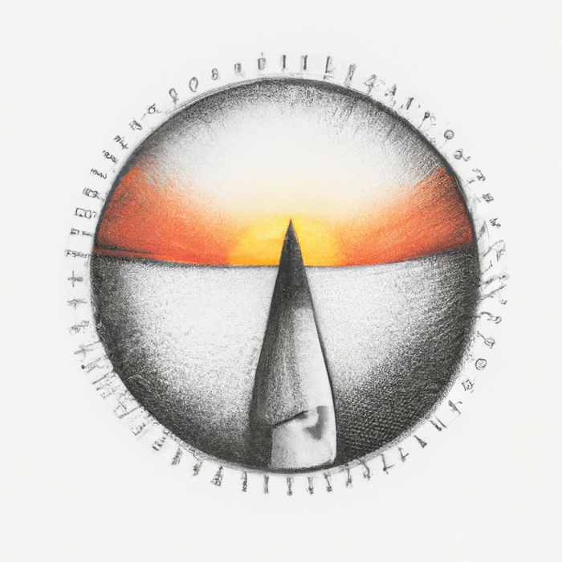

# Rocket.Chat apps: Golinks

Automatically convert golinks (go/some-thing) into URLs to your shortlink service.

## Usage

Before the golinks app rewrites `go/` links, make sure to configure the full URL to your
shortlink provider in the settings (`Apps` > `Installed` > `Golinks` > `Settings`), e.g.:

* `https://golinks.rocket.chat/`

**Note: `https://` and the trailing slash `/` is required.**
